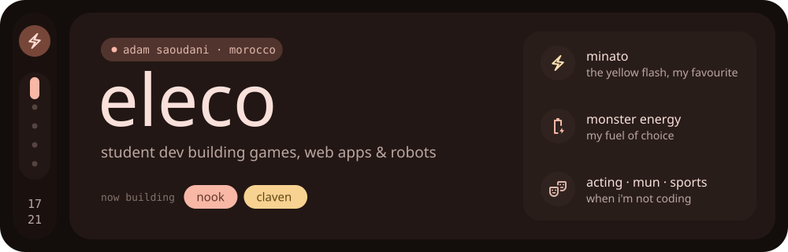
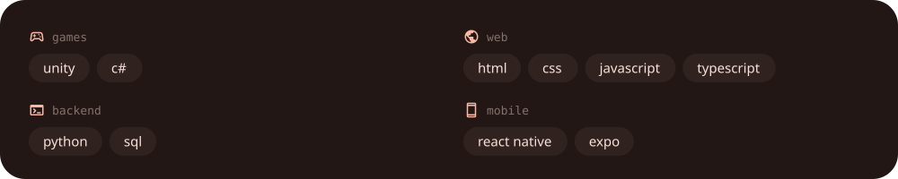

  

I'm Adam, but online I go by **Eleco**. I'm a developer from Morocco who loves creating, building, and constantly learning new things.

> *I'm incredibly grateful to code on this laptop that my mom saved up for months and months to get for me. Thanks, mom ❤️*

### currently building

  
  

also around: <a href="https://github.com/adamsaou/ODC-WRO2026">WRO 2026 robotics</a> · <a href="https://github.com/adamsaou/3andiBlastiCode">FTC team #28552</a> · <a href="https://github.com/adamsaou/IOI-Prep">IOI prep</a> · <a href="https://github.com/adamsaou/Razor-esports">Razor e-sports</a>

### stack

### activity

  

  &nbsp;
  

